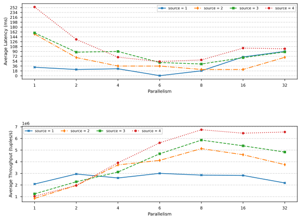

# Benchmarking Suite - Interval Join performance evaluation

This repository contains a benchmark suite for evaluation of Interval Join operation respectfully for [Flink](https://flink.apache.org/) and [Windflow](https://paragroup.github.io/WindFlow/) implementation.

## WindFlow Dependencies

In order to run the Flink implementation in this project, the following dependencies are needed:
* a C++ compiler with full support for **C++17** like **GCC** (GNU Compiler Collection) version >= 8 or **Clang 5** and later
* [WindFlow](https://github.com/ParaGroup/WindFlow/releases) library version >= 4.0.0 and all the required dependencies
* [FastFlow](https://github.com/fastflow/fastflow/releases) library version >= 3.0 and all the required dependencies
* [RapidJSON](https://rapidjson.org/) parser for C++. You can install the package on **Ubuntu** by running `sudo apt-get install -y rapidjson-dev` command.

## Flink Dependencies

Whole suite can be run on local machine, further information can be found in the [official documentation](https://nightlies.apache.org/flink/flink-docs-release-1.16/docs/dev/dataset/local_execution/) and in internal [README](https://github.com/DropB1t/IntervalJoinBenchmarks/tree/main/flink) file.

In order to run the Flink implementation in this project, the following dependencies are needed:
* [Apache Flink](https://nightlies.apache.org/flink/flink-docs-release-1.16/) version >= 1.16.0
* [Java JDK](https://openjdk.java.net/install/) version >= 1.11
* [Maven](https://maven.apache.org/install.html) version >= 3.9.6

## Run Benchmark script
You can generate whole test cases simply by running the `run_benchmarks.sh` located in the `/scripts` folder. The provided script cycles through all parameters specified in the [config](./scripts/config) file and generates *throughput* and *latency* charts by running the `draw_charts.py` Python tool.

In order to install the `draw_charts.py` dependencies you need to have on your system [**pip**](https://github.com/pypa/pip): the package installer for Python.
After that, simply set up a virtual environment by using the [venv](https://docs.python.org/3/library/venv.html) package and run the following command inside the `/scripts` folder:

```
pip install -r requirements.txt
```

### Draw Charts Script

The `draw_charts.py` script is used to generate various charts based on the benchmark results. It supports generating latency, throughput, per batch, per source, and comparison charts.

#### Usage

```
python draw_charts.py <chart_type> [additional arguments]
```

#### Parameters

- `chart_type` (str): The type of chart to draw. Valid options are:
  - `lt`: Latency chart
  - `th`: Throughput chart
  - `all`: Both latency and throughput charts
  - `src`: Average performance per source chart
  - `batch`: Average performance per batch chart
  - `comparison`: Comparison chart between all 3 execution modes (key parallelism, data parallelism, and Flink modes)

##### Additional Arguments

- For `comparison` chart type:
  - `res_dir` (str): Path to the results directory where the images will be saved.
  - `kp_dir` (str): Path to the key parallelism mode directory.
  - `dp_dir` (str): Path to the data parallelism mode directory.
  - `fl_dir` (str): Path to the Flink tests directory.
  - `img_name` (str): Name of the image file to generate.

- For other chart types:
  - `tests_path` (str): Path to the tests folders.

#### Example

To generate a comparison chart, you can use the following command:

```
python draw_charts.py comparison /path/to/results /path/to/kp_dir /path/to/dp_dir /path/to/fl_dir image_name
```

To generate a latency chart, you can use the following command:

```
python draw_charts.py lt /path/to/tests
```

### Results folder structure example
```
.
└── results/
    └── {framework_type}/
        └── {workload_type}/
            └── [{parallelism_mode}]/
                └── [{synthetic_keys_number}]/
                    └── [{batching_size}]/
                        ├── {source_degree}/
                        │   ├── {1_test_1}/
                        │   │   ├── ...
                        │   │   ├── latency.pdf
                        │   │   └── throughput.pdf
                        │   ├── {2_test_2}/
                        │   ├── {3_test_4}/
                        │   ├── {4_test_6}/
                        │   └── avg_source.pdf
                        └── avg_batch.pdf
```


## Synthetic Datesets
In order to generate the synthetic datasets you can compile and run the C++ tool located in `/gen_dataset` folder. Further instructions for using the tool can be found in the inner [README](https://github.com/DropB1t/IntervalJoinBenchmarks/tree/main/gen_dataset) file.

## Real World Datasets
In order to run a benchmark, of each implementaion, with real datasets you need to download the [datasets.tar.gz](https://www.dropbox.com/scl/fi/y4qkcvci7yqcypg41tu85/datasets.tar.gz?rlkey=6o2d4byhx95d860pojddka4iq&dl=0) archive and unzip it by calling `tar -zvxf datasets.tar.gz` command into root of this repository. Otherwise you can run the `./download_datasets.sh` script located in `/scripts` folder.

Credits for datasets goes to [AllianceDB](https://github.com/intellistream/AllianceDB/blob/master/docs/README.md) project.

## Chart examples




